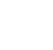

# Canerly — logo

Monochrome. All files are outlined SVG: no font dependency, no external
references, scales cleanly to any size. Two files, and only these two:

| File | Ships as | Use |
| --- | --- | --- |
| `canerly-lockup-horizontal.svg` | black | The logo — site headers, docs, signatures |
| `canerly-symbol.svg` | white | The icon — favicon, avatars, tight spaces, app chrome |

## The mark

A crested canary in side profile, facing right. It's one closed silhouette with
the eye knocked out (`fill-rule="evenodd"`), so it works on any background without
a second colour. The beak points into the wordmark, leading the eye toward the name.

The wordmark is Manrope 800, tracked to −0.035em, with one custom letter: the `y`
descender sweeps into a tail flick that echoes the bird's tail. That flick is what
makes it a wordmark rather than a name typed in a typeface — keep it.

## Colour

Black `#000000` on light, white `#FFFFFF` on dark. To reverse, set `fill` on the
`<svg>` — the paths inherit it:

```html
   <!-- black, as shipped -->
              <!-- white, as shipped -->
```

The symbol ships white on a transparent ground, so it needs a dark surface behind
it. On a light one it disappears — set `fill="#000"` there.

Inline, for a colour that follows the theme, swap `fill="#000"` on the root
`<svg>` for `fill="currentColor"`.

## Clear space

Keep clear space on all sides equal to **half the symbol's height**. Nothing —
type, rules, image edges — inside that.

## Minimum sizes

| | Minimum |
| --- | --- |
| Symbol | 16 px tall |
| Horizontal lockup | 100 px wide |

Below 16 px the tail thins out.

## Don't

- Recolour to anything but black or white
- Rebuild the lockup by hand — the symbol-to-wordmark gap and sizing are set
- Stretch, rotate, outline, or add effects
- Set "Canerly" in another typeface and call it the wordmark
