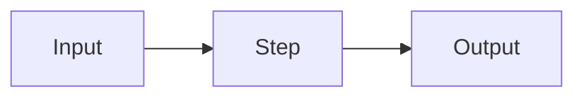

# How to Structure and Write Daily Educational Math/Engineering Blog Posts in a Single README.md

## TL;DR
- **Lead with the answer, teach with an example, then formalize.** For a mixed student+professional audience the winning order is: metadata → 2–3 sentence TL;DR → "why care" hook + prerequisites → problem statement → concrete worked example → intuition → formalism/math → implementation → limitations/common mistakes → summary → references. This front-loads value (inverted pyramid/BLUF) while respecting the *worked-example effect*, which John Sweller (2006) called "the best known and most widely studied of the cognitive load effects" and which works best for novices when examples are "offered in the early stages of skill acquisition" (Renkl & Atkinson, 2010).
- **Use YAML frontmatter as your single source of truth for tags and metadata**, keep exactly one H1 (or let the title come from frontmatter), pair every equation and every diagram with one plain-language sentence, write descriptive alt text for every remote image, and serve images from stable versioned MinIO URLs so GitHub's Camo proxy and your own renderer never show a stale or broken picture.
- **A daily cadence is sustainable only with a fixed template and a pre-publish checklist.** Target ~1,000–1,800 words (a 5–8 minute read) per daily post, 1–3 Mermaid diagrams max, and use `<details>` collapsible blocks + progressive disclosure so the same post serves both students and professionals.

## Key Findings

### 1. The evidence base (what is proven vs. convention)
There is genuine cognitive-science evidence behind the recommended structure — it is not just style opinion.

- **Worked-example effect (strong evidence).** Studying a fully worked solution beats unguided problem-solving for novices because it reduces extraneous cognitive load by reducing element interactivity. Sweller (2006) calls it "the best known and most widely studied of the cognitive load effects." Renkl & Atkinson (2010) found worked examples "contribute positively to the learning performance when offered in the early stages of skill acquisition. However, students will likely stop paying attention to them in later stages." This is why a concrete worked example should come *before* heavy formalism.
- **Expertise reversal effect (strong evidence).** The same worked examples "may no longer be effective" as expertise increases — for experts the extra guidance becomes redundant "or even counter-productive." This is the core reason your posts must serve two audiences differently: put scaffolding up front for students and let experts skip it via collapsible sections and a jump-to TOC.
- **Dual coding theory (Paivio) + Mayer's multimedia principle (strong evidence).** People learn more deeply from words and relevant pictures together than from words alone. Per Clark & Mayer (2016), across the studies comparing words-and-pictures against words-alone, learners scored a median percentage gain of 89% with a median effect size of about d = 1.35, and essentially every test favored the dual representation (Mayer, "The Multimedia Principle," *Cambridge Handbook of Multimedia Learning*). This justifies pairing every diagram/equation with prose.
- **Mayer's spatial contiguity principle (strong evidence).** "People learn better when corresponding words and pictures are presented near rather than far from each other." Put each image/diagram immediately next to the text that explains it — never dump all figures at the end.
- **Mayer's coherence + signaling principles (strong evidence).** In Mayer's own reviews, the coherence principle ("exclude extraneous material") was supported in 18 of 19 experimental tests with a median effect size of 0.86, and the signaling principle ("add cues that highlight the organization of essential material") was effective in 15 of 16 tests with a median effect size of 0.69 (Mayer, "Research-Based Principles for Designing Multimedia Instruction"). Translation: cut decorative images and tangents; use clear headings and callouts as signals.
- **Concreteness fading (moderate evidence).** Start concrete, then fade to abstract — "If you don't move beyond concrete examples, you will actually never be able to do any transfer." Concrete numbers before general formulas.
- **Inverted pyramid / BLUF (convention, strong practitioner support).** Nielsen Norman Group eyetracking found that 79% of users scan any new page and only 16% read word-by-word, and their 2008 study "How Little Do Users Read?" concluded that "on the average Web page, users have time to read at most 28% of the words during an average visit; 20% is more likely" — so front-load the conclusion. This is journalism/technical-writing convention, well-supported by usability research but not a lab-proven learning effect.

**The apparent tension** — inverted pyramid says "answer first," worked-example effect says "example before theory," concreteness fading says "concrete before abstract" — actually resolves into one order: **short answer/TL;DR at the very top, then a concrete worked example, then the abstract formalism.** All three agree the formal/abstract material comes later.

### 2. Math content vs. engineering content — when to change the order
- **Engineering / AI-ML "how it works" posts:** Lead harder with the inverted pyramid. Give the result, then a runnable example, then theory. This matches how Jay Alammar, Lilian Weng, and Julia Evans write.
- **Pure-math / derivation posts:** Still open with intuition and a concrete instance, but the "formalism" section carries more weight and derivations can be longer. Use concreteness fading explicitly: numeric example → symbolic generalization → proof/derivation (in a collapsible block if long).
- **Rule of thumb:** the more novel and mathematically dense the topic, the more you rely on worked examples up front; the more your audience is expert, the more you can invert (state the theorem, then discuss).

## Details

### 3. The canonical section order (and why)
1. **Frontmatter (metadata)** — machine-readable; drives tags, search, cards, SEO.
2. **H1 title** (or rendered from frontmatter — see §5).
3. **TL;DR / summary (2–4 sentences or 3 bullets).** BLUF: the single most important takeaway first. Serves skimmers and experts.
4. **Hook + "why should I care"** (2–4 sentences). One real problem this solves.
5. **Prerequisites + difficulty + estimated time.** State them explicitly so students self-select and experts skip.
6. **Problem statement.** Define the problem *before* the solution. Concrete, with real numbers.
7. **Worked example / concrete walk-through.** The "worked-example effect" section — do it with numbers before symbols.
8. **Intuition.** Analogy or picture of what's really happening.
9. **Formalism / the math.** Notation defined, every symbol explained, equations each followed by a plain sentence.
10. **Implementation / code.** For engineering posts.
11. **Limitations, edge cases, common mistakes, "intuition check."**
12. **Summary / recap + key takeaways.** (TL;DR repeated/expanded at bottom aids retention.)
13. **Exercises / "try it yourself"** (optional, boosts engagement).
14. **Further reading + references/citations.**

Not every post needs all 14; the *order* is the invariant, the presence of each block is optional.

### 4. Frontmatter: what fields to use
Real Markdown publishing systems converge on a small set of near-required fields. Hugo's most common are "date, draft, title, and weight"; Jekyll uses layout/title/date/categories/tags/excerpt; Astro Content Collections schemas standardize on `title`, `description`, `pubDate`, `updatedDate`, `tags`, `draft`, `heroImage`, and increasingly `category`/`level`/`readingMinutes`. Description is commonly capped for SEO (`z.string().max(160), // SEO-optimized length`).

Because your platform is **tag-driven with Postgres and no vector search, tags are the most important field in the file.** Declare them as a first-class array and treat them as your retrieval index. Recommended frontmatter for your platform:

```yaml
---
title: "Backpropagation by Hand: One Worked Example"
slug: backpropagation-by-hand
date: 2026-09-05
updated: 2026-09-05
summary: "Compute gradients for a 2-layer net with real numbers, then generalize the chain rule. For students and practitioners."
tags: [deep-learning, backpropagation, calculus, neural-networks, gradients]
category: ai-ml
difficulty: intermediate          # beginner | intermediate | advanced
prerequisites: ["partial derivatives", "chain rule", "vectors"]
reading_minutes: 7
cover_image: "https://cdn.yourblog.dev/covers/backprop-v3.png"
canonical_url: "https://yourblog.dev/p/backpropagation-by-hand"
---
```

- **Tags:** 4–7 lowercase, hyphenated, reused from a controlled vocabulary. Since retrieval and personalization depend on them, keep a canonical tag list in your DB and lint each post's tags against it — free-typing tags fragments your index.
- **category** = the engineering domain (your top-level organization).
- **difficulty + prerequisites** power the "who is this for" filtering that lets one post serve students and professionals.
- **cover_image / canonical_url** should be stable versioned URLs (see §7).

### 5. Heading hierarchy and Markdown mechanics
- **Exactly one H1 per document.** Either write it as the single `#` line, or render it from `frontmatter.title` and start your body at H2 — do not do both (duplicate H1s hurt SEO and accessibility). Pick one convention platform-wide.
- **H2 for major sections, H3 for sub-points.** Don't skip levels. Question-style H2/H3 ("How does attention work?") aid both skimming and AI answer-engine extraction.
- **Table of contents:** auto-generate from headings if your renderer can; only hand-write a TOC for very long posts (>2,000 words). GitHub auto-generates a heading menu for READMEs. A hand-written TOC with anchor links is worth it for pillar posts because it lets experts jump ahead (expertise reversal).
- **Section length:** aim for 150–300 words per H2 block; if a section runs past ~400 words, split it.
- **Paragraphs:** 2–4 sentences. One idea per paragraph.
- **Lists vs prose vs tables:** prose for reasoning and narrative; bulleted lists for parallel items/steps; numbered lists for ordered procedures; tables for comparisons across 2+ dimensions (e.g., algorithm vs. complexity vs. use-case).
- **Callouts (GitHub alerts).** GitHub supports five blockquote alerts — `> [!NOTE]`, `> [!TIP]`, `> [!IMPORTANT]`, `> [!WARNING]`, `> [!CAUTION]` — officially launched December 2023 after a May 2022 beta. They render as colored callouts in READMEs, issues, and PRs. Use NOTE for asides, TIP for shortcuts, WARNING for common mistakes. Note they are a GitHub renderer feature, "not part of the GFM spec," so if you render Markdown yourself you must add a plugin (e.g., `remark-alerts`).
- **Code blocks:** always add a language hint (```python, ```sql) for syntax highlighting.
- **Collapsible depth:** use `<details><summary>…</summary>…</details>` for long derivations, full proofs, or verbose logs — this is how you give experts depth without overwhelming students (progressive disclosure).
- **Footnotes:** GFM supports `[^1]` footnotes; use them for citations and asides so the main text stays clean.

### 6. Writing math in Markdown
Per GitHub's official docs ("Writing mathematical expressions"), GitHub renders math with **MathJax** — added May 19, 2022 — in "GitHub Issues, GitHub Discussions, pull requests, wikis, and Markdown files." Supported delimiters:
- **Inline:** `$...$` **or** the backtick form `` $`...`$ ``. GitHub docs: "The latter syntax is useful when the expression you are writing contains characters that overlap with markdown syntax."
- **Block:** `$$...$$` **or** a fenced ```` ```math ```` code block ("you don't need to use $$ delimiters").
- `\(...\)` / `\[...\]` are **not** documented by GitHub — don't rely on them for GitHub rendering (they work in some other engines/plugins).

**Gotchas (from GitHub docs and community):**
- A stray `$` on a math line can be misread as a delimiter — escape it: "add a `\` symbol before the explicit $" inside math, or wrap it in `<span>$</span>` outside math.
- GitHub's Markdown sanitizer can mangle `$...$` containing `_` or `[]`; the fix is the backtick-delimited inline syntax.
- `\label` / `\eqref` auto-numbering and cross-references do **not** work on GitHub (numbering must be enabled in MathJax config, which GitHub doesn't expose). If you need numbered equations, number them manually in text.

**Rendering choice for your own platform:** Use **KaTeX** for speed ("KaTeX is generally faster than MathJax") or **MathJax** for maximum LaTeX coverage and better accessibility. Do **not** render math as images except as a last-resort fallback — image math is inaccessible to screen readers unless you supply full alt text, doesn't reflow, and is bad for SEO. KaTeX/MathJax output real text/MathML.

**Rules of thumb for math:**
- Introduce notation before using it; **define every symbol** the first time it appears (a small "notation" table helps).
- Show a numeric instance before the general formula (concreteness fading).
- **Pair every equation with one plain-language sentence** saying what it means ("This says the gradient is the error times the input").
- Put long derivations in a `<details>` block or an appendix section — keep the main flow readable.
- Include only the math that earns its place; the coherence principle says extraneous material hurts.

### 7. Images fetched by URL at runtime (you use MinIO)
Because your images are remote and resolved at render time, reliability and accessibility are the main risks.

- **Alt text on every meaningful image.** Keep it descriptive and specific, ~80–140 characters, and skip "image of." For charts/diagrams, give a short alt plus a longer text description nearby. Google explicitly says it uses alt text to understand images, and WCAG 2.2 makes alt text a Level A requirement.
- **Captions + figure numbering.** Number figures ("Figure 1") and reference them in the text ("as Figure 1 shows"). This lets you refer back and supports experts skimming.
- **Placement = spatial contiguity.** Put each image immediately adjacent to the paragraph it illustrates, not batched at the end.
- **Aspect ratio / width + layout shift.** Plain Markdown `` can't set dimensions, and unsized remote images are "the #1 cause of bad CLS" — a single unsized hero image "can produce a layout shift score of 0.2–0.5." Use inline HTML `` so the browser reserves space before the image loads.
- **Hotlinking / stability.** Hotlinking a URL you don't control risks broken images (renaming the source "will cause the hotlinks to break, prompting 404 errors"), referrer blocks (403), latency, and loss of control. Serve from your own MinIO/CDN.
- **GitHub proxies external images via Camo.** If these posts also render on GitHub, GitHub rewrites every external `` through `camo.githubusercontent.com`, which per the atmos/camo README enforces `CAMO_LENGTH_LIMIT` with a default of 5242880 bytes (~5 MB) and a content-type whitelist, and — per observed response headers (`cache-control: public, max-age=31536000`) — caches images for up to a year. A stale or oversized image can therefore appear broken.
- **MinIO best practice:** use **versioned/fingerprinted object URLs** (e.g., `backprop-v3.png` or `?v=3`) with a long-lived immutable cache header (`Cache-Control: max-age=31536000, immutable`). web.dev recommends exactly this: "embedding a fingerprint of the file, or a version number, in its filename." When you edit an image, change the URL — this busts both browser and Camo caches at once and is why a stable canonical URL matters. Keep hero/cover images under 5 MB.

### 8. Mermaid diagrams in educational posts
Mermaid is already embedded in your README pipeline, so use it — but only when it genuinely reduces cognitive load, not as decoration (coherence principle). Match diagram type to explanation type:

| Explanation type | Mermaid type |
|---|---|
| Algorithm / process / decision logic / pipeline | `flowchart` (graph) |
| Protocol / API / message passing over time | `sequenceDiagram` |
| State machine / lifecycle / status flow | `stateDiagram-v2` |
| Data model / OOP classes | `classDiagram` |
| Database schema | `erDiagram` |
| Project timeline / history | `timeline` / `gantt` |
| Proportions / quick breakdown | `pie` |
| Trade-off / 2×2 positioning | `quadrantChart` |
| Commit/branch history | `gitGraph` |

"The most common mistake is using a flowchart for everything... The right diagram type makes the same information 10× clearer."

- **How many:** 1–3 per daily post. More than that usually means the post should be split.
- **Keep them small:** ≤ ~10 nodes; if bigger, split into two diagrams or use a subgraph.
- **Caption and reference every diagram** in the text, and write a sentence explaining what it shows *before or after* it — never drop a diagram without narration (dual coding: the words + picture together do the teaching).

### 9. Writing craft for math/engineering education
- **Opening hook:** one real problem, one sentence. ("Your model trains but the loss won't drop — here's the gradient math that explains why.")
- **Prerequisites explicitly stated** so students know what to review and experts know they can skip.
- **Problem before solution; concrete numbers before general formulas.**
- **Analogies:** powerful but flag where they break down ("this analogy fails once you add more than two layers") — a bad analogy misleads. This is the "monad tutorial fallacy": intuition that made sense to *you* often doesn't transfer.
- **Progressive disclosure / layered depth:** main line for students; `<details>` blocks, footnotes, and "going deeper" asides for professionals. This is the single most important technique for serving a mixed audience and is grounded in the expertise reversal effect.
- **"Common mistakes" and "intuition check" sections** catch misconceptions — high value, low cost.
- **Worked examples** carry the teaching load for novices; put them early.
- **Exercises at the end** (with hidden answers in `<details>`) boost retention/engagement.
- **TL;DR placement:** put a short one at the **top** (BLUF, for skimmers/experts) and a fuller recap at the **bottom** (for retention). Both, not either.
- **How to end:** a 3–5 bullet "key takeaways," then "further reading," then references. Don't trail off — restate the one thing to remember.
- **Citations:** link primary sources (papers, docs) inline or as footnotes; for math, cite the theorem/source. Simple, consistent, non-spammy.

### 10. SEO and discoverability (practical, not spammy)
- **Title patterns:** front-load the primary keyword, keep the SEO/meta title ≤ ~60 characters, and make a clear promise. Patterns that work: "How to X," "X, Explained," "X by Hand," "A Visual Guide to X," "[Number] … ." Numbers and specificity help.
- **First 100–150 words matter most:** your TL;DR should contain the primary keyword naturally and answer the core question directly — "AI engines extract direct answers early in content."
- **Semantic headings:** keyword-relevant H2/H3s; use question-form headings for AI answer engines.
- **Meta description / summary:** 150–160 characters, specific, no "This post will…" — reuse your frontmatter `summary`.
- **Internal linking:** link related posts to build topic clusters ("AI systems favour sources that cover a topic comprehensively"). Your tag graph is the natural backbone for "related posts."
- **Structured data:** emit JSON-LD `BlogPosting`/`TechArticle` from your frontmatter (headline, datePublished, author, description, image) — Astro/Hugo blogs do this from the same fields.
- **Tags and discoverability:** since retrieval is tag-driven, your controlled tag vocabulary *is* your SEO taxonomy. Consistent tags → coherent internal linking → topical authority.

### 11. Sustaining a daily cadence
- **Length:** for a *daily* technical post, target **~1,000–1,800 words / 5–8 minute read** — long enough for depth, short enough to write and read daily. Medium's Data Lab analysis ("The Optimal Post is 7 Minutes") found time-on-post "peaks at 7 minutes, and then declines," which lands around 1,600 words; go longer only for occasional pillar posts and split anything that has a natural break.
- **One template, filled top to bottom** (below). Julia Evans' model is instructive: short, focused, "topics that I'm mad that no one told me about," written to teach rather than to impress.
- **Batch the boring parts:** keep the controlled tag list, the frontmatter snippet, and the pre-publish checklist as editor snippets.
- **Series:** if a topic is too big for one day, split into a numbered series — sustainable and builds internal links.
- **Quality control:** run the checklist below every day; it's faster than re-editing.

### 12. Exemplars and the recurring pattern
- **Jay Alammar — The Illustrated Transformer:** big-picture first (encoder/decoder), then progressively zoom in, diagram-per-concept, minimal notation until you've seen the picture. Pattern: **visual intuition → mechanism → math.**
- **Lilian Weng — Lil'Log:** "work[s] through a topic from its foundations, collect[s] the relevant research, and present[s] the mathematics and intuition together with diagrams," with a hand-written TOC, reading-time estimate, and a citations section. Reference-quality surveys.
- **Julia Evans — jvns.ca / Wizard Zines:** short, concrete, plain language, "how stuff works," zero condescension; writes about facts and stories, not opinions.
- **Distill.pub:** dedicated to "outstanding communication," explanatory over results-listing — "explains the method's derivation, visual behavior, and conceptual foundations." "Articles should be whatever length best serves the reader — just be aware that rambling is an easy failure mode."
- **3Blue1Brown, Chris Olah, betterexplained.com, Paul's Online Math Notes, Khan Academy:** all lead with concrete/visual intuition and fade to abstraction.

**Recurring structural pattern across all of them:** hook/why → concrete or visual example → intuition → formal math → implementation/depth (optional/collapsible) → summary → references, with words and pictures always paired and placed together.

---

## The copy-pasteable README.md template (the centerpiece)

```markdown
---
title: "Clear, Keyword-First Title (≤60 chars for SEO)"
slug: url-safe-slug
date: 2026-09-05
updated: 2026-09-05
summary: "One or two sentences, 150–160 chars, contains the primary keyword. Reused as meta description."
tags: [domain-tag, topic-tag, concept-tag, tool-tag]   # 4–7, from your controlled list
category: ai-ml
difficulty: beginner            # beginner | intermediate | advanced
prerequisites: ["thing 1", "thing 2"]
reading_minutes: 7
cover_image: "https://cdn.yourblog.dev/covers/topic-v1.png"   # stable, versioned URL
canonical_url: "https://yourblog.dev/p/slug"
---

# Clear, Keyword-First Title
<!-- ONE H1 only. If your renderer prints frontmatter.title, delete this line and start at ## -->

> [!NOTE]
> **TL;DR** — The single most important takeaway in 2–3 sentences. Answer the core
> question here so a skimmer or expert gets value immediately. (BLUF)

**Who this is for:** difficulty + one line. **Prerequisites:** list. **Time:** ~7 min.

## Why this matters
2–4 sentences. One real problem this solves. The hook.  (~60–120 words)

## The problem
Define the problem precisely, with concrete numbers, *before* any solution. (~100–200 words)

## Worked example (with real numbers)
Walk through one concrete instance step by step. This is the highest-value section
for novices. Numbers before symbols.  (~200–350 words)


*Figure 1. Caption that says what to notice.*

## Intuition
What's really going on, in plain language / an analogy. Flag where the analogy breaks.
(~150–250 words)


*Figure 2. One sentence explaining the diagram.*

## The math
Define every symbol on first use.

$$
\text{loss} = \frac{1}{n}\sum_{i=1}^{n}(y_i - \hat{y}_i)^2
$$

In plain words: this averages the squared error over all `n` examples.

<details>
<summary>Full derivation (optional depth)</summary>

Long derivation here — hidden so students aren't overwhelmed and experts can expand.
</details>

## Implementation
```python
# runnable, minimal, commented
```

> [!WARNING]
> **Common mistake:** the one error people always make here, and how to avoid it.

## Limitations & when not to use this
Bullet the edge cases and failure modes honestly.

## Key takeaways
- Point 1
- Point 2
- Point 3

## Try it yourself (optional)
1. Exercise.
<details><summary>Answer</summary>…</details>

## Further reading & references
- [Primary source / paper](https://…)
- [Docs](https://…)

[^1]: Footnote-style citation if preferred.
```

## The pre-publish checklist (run every day)

**Metadata**
- [ ] One H1 only (or title from frontmatter, not both)
- [ ] `title` ≤ 60 chars, keyword front-loaded
- [ ] `summary` 150–160 chars, contains primary keyword
- [ ] 4–7 `tags`, all from the controlled vocabulary (lint against DB)
- [ ] `category`, `difficulty`, `prerequisites`, `reading_minutes` set
- [ ] `cover_image` and `canonical_url` are stable versioned URLs

**Structure**
- [ ] TL;DR at top answers the core question in the first ~100 words
- [ ] Prerequisites stated explicitly
- [ ] Problem stated before solution
- [ ] A concrete worked example appears before heavy formalism
- [ ] Key-takeaways recap at the bottom

**Math**
- [ ] Every symbol defined on first use
- [ ] Every equation followed by a plain-language sentence
- [ ] Long derivations in `<details>` or appendix
- [ ] `$`/`$$` delimiters correct; stray `$` escaped

**Images**
- [ ] Descriptive alt text (~80–140 chars) on every meaningful image
- [ ] `width`/`height` set (via ``) to prevent layout shift
- [ ] Figures numbered, captioned, and referenced in text
- [ ] Images served from versioned MinIO/CDN URLs, each < 5 MB
- [ ] Placed adjacent to the explaining text

**Diagrams**
- [ ] 1–3 Mermaid diagrams, correct type for the content
- [ ] Each ≤ ~10 nodes, captioned, and explained in prose

**Final**
- [ ] Length ~1,000–1,800 words (split if longer with no break)
- [ ] Code blocks have language hints
- [ ] Internal links to 1–3 related posts
- [ ] Spellcheck, broken-link check, preview render

## Recommendations
1. **Adopt the 14-section order and the template as-is for week one.** Fill it top to bottom daily. The fixed order removes the biggest daily-cadence cost — deciding what goes where.
2. **Build a controlled tag vocabulary in Postgres now and lint every post against it.** Since you have no vector search, tag consistency *is* your retrieval quality. Free-typed tags will silently degrade search and personalization. Benchmark to change course: if >10% of posts introduce a brand-new tag, your vocabulary needs a curation pass.
3. **Standardize on KaTeX for rendering and versioned MinIO URLs for images.** Set `Cache-Control: max-age=31536000, immutable` on image objects and change the filename/`?v=` on every edit. This eliminates stale/broken images and Camo-cache surprises.
4. **Enforce the pre-publish checklist as a CI lint** (frontmatter schema like Astro's Zod, one-H1 rule, alt-text presence, tag validation, word count). Automating the checklist is what makes daily quality sustainable.
5. **Use `<details>` + top/bottom TL;DR as your standard dual-audience mechanism** on every post. This is your cheapest lever for serving students and professionals from one file.
6. **Cap daily posts at ~1,800 words and 3 diagrams; split bigger topics into numbered series.** Series also generate internal links for free.
7. **Thresholds that change the plan:** if average reading time drops or bounce rises on long posts, shorten toward 1,000 words; if experts complain of being talked down to, move more scaffolding into collapsible blocks (expertise reversal); if a topic can't be worked-example-first (rare in pure math), fall back to theorem-then-discussion order.

## Caveats
- **Evidence vs. convention:** the worked-example effect, expertise reversal effect, dual coding, and Mayer's contiguity/coherence/signaling principles are supported by controlled studies. The inverted-pyramid/BLUF ordering, ideal word counts, title patterns, and SEO tactics are **practitioner convention** backed by usability data and industry analytics, not learning-science experiments — treat them as strong defaults, not laws.
- **Blog-length figures are marketing-industry aggregates** (Buffer/HubSpot/Medium) and correlational; word count is not a direct Google ranking factor. Write to the topic, not the number.
- **GitHub-specific rendering facts** (MathJax delimiters, alerts, Camo proxy, 5 MB cap) are from GitHub's own docs/changelog and the atmos/camo project, and are reliable — but apply to *GitHub's* renderer. Your own platform's renderer may differ — verify KaTeX/MathJax delimiters and alert-plugin support in your stack.
- **`\(...\)` / `\[...\]` and `\label`/`\eqref`:** not supported on GitHub; support elsewhere varies. Confirm in your renderer before relying on them.
- **Alt-text and CLS numbers** (80–140 chars, CLS 0.2–0.5) are widely cited best-practice figures from SEO/accessibility vendors, not hard standards; WCAG only mandates that meaningful images *have* alt text.
- I could not find a **MinIO-specific primary doc** for the cache/versioning pattern; the guidance is inferred from the general S3-compatible object-store + CDN + web.dev caching pattern, which MinIO supports (object versioning and per-object Cache-Control metadata).