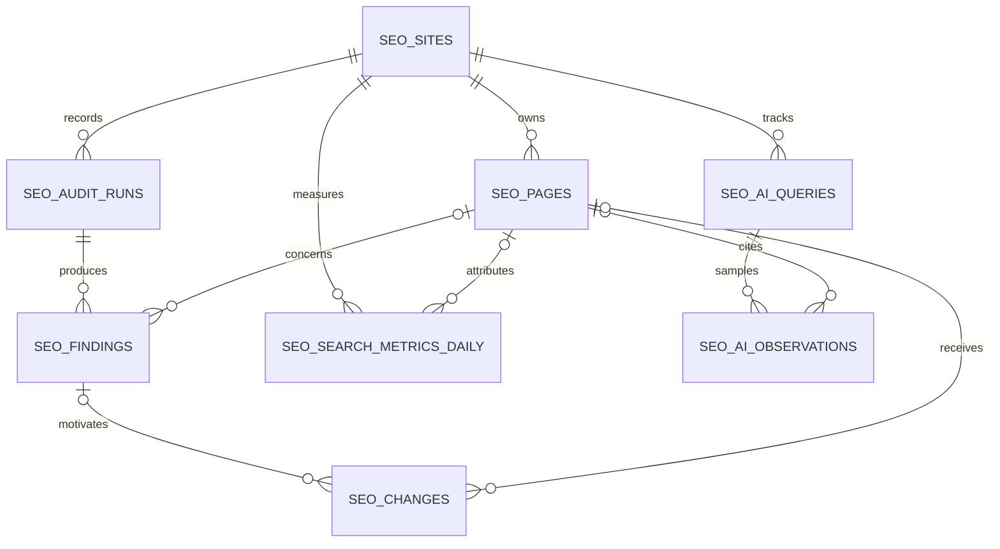

# Canery SEO plugin

The plugin is a local, read-only audit and content-planning layer. It improves
the prerequisites for discovery; it cannot guarantee a search rank or an
AI-generated citation.

## Run it

Directly from any terminal or IDE task:

```bash
./.claude/blog-forge/bin/canery-seo audit --config seo.config.json
./.claude/blog-forge/bin/canery-seo daily --config seo.config.json
```

`daily` also checks the deployed `robots.txt` and `sitemap.xml`, then writes
dated Markdown and JSON under `reports/seo/`. The audit never edits a post.

The repository-local Claude marketplace is declared in
`.claude-plugin/marketplace.json` and enabled in `.claude/settings.json`. Claude
Code and the Claude VS Code extension use that same project configuration. For
an isolated test session:

```bash
claude --plugin-dir ./.claude/blog-forge
```

Available slash commands include `/blog-forge:seo` and
`/blog-forge:seo-daily`. The plugin also exposes `seo-audit`, `seo-daily`,
`seo-content`, and `ai-discoverability` skills.

For a durable daily run without GitHub, schedule the direct executable with the
operating system or a Claude Desktop routine. Do not rely on a session-scoped
Claude Code loop for long-term monitoring.

## Optional backend history

Migration `011_seo_observability.sql` stores audit history and leaves the
existing Markdown publication flow untouched. The plugin can submit an audit
when a current admin bearer token and the full private admin endpoint are
provided:

```bash
BLOG_ADMIN_ACCESS_TOKEN=<short-lived-token> \
  ./.claude/blog-forge/bin/canery-seo audit \
  --config seo.config.json \
  --submit-url 'https://api.canery.in/<private-prefix>/admin/seo/audits'
```

The endpoint stays under the existing secret admin prefix and is excluded from
OpenAPI. Do not store the prefix or token in source control. A short-lived admin
token is suitable for an attended run; unattended backend submission needs a
separate service-credential design before it should be enabled.

## Data model



- `seo_sites`: origin, brand, Search Console property, and timezone.
- `seo_pages`: canonical/indexability inventory and last audited content hash.
- `seo_audit_runs`: immutable run envelope and summary.
- `seo_findings`: rule, severity, evidence, fingerprint, and resolution state.
- `seo_search_metrics_daily`: page/query/day Search Console snapshots.
- `seo_ai_queries` and `seo_ai_observations`: declared prompts and evidence-based
  citation/mention observations.
- `seo_changes`: human-approved proposal/application history. Audit ingestion
  cannot publish or rewrite Markdown.

## Site integration

The Next.js reader now emits a complete paginated sitemap, a robots route,
Organization/WebSite JSON-LD, and BlogPosting JSON-LD. It normalizes persisted
legacy canonicals to `/blogs/<slug>`, redirects old `/p/<slug>` URLs, and
suppresses legacy Markdown H1 headings because the article shell already owns
the page H1.
